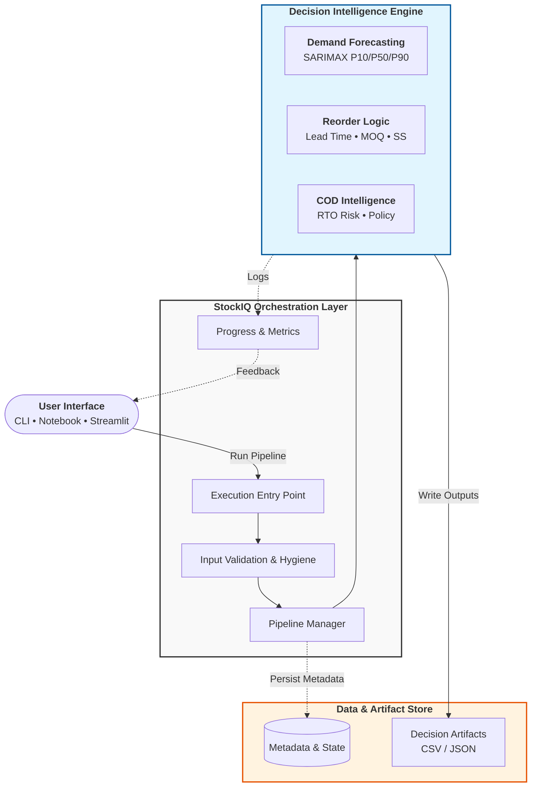

# StockIQ

Made by Yash Maheshwari

## Executive Summary

StockIQ is an end-to-end Inventory, Forecasting, Reorder, and COD Intelligence system for D2C businesses. It turns raw operational data (orders, inventory events, vendors, campaigns) into probabilistic demand forecasts (P10/P50/P90), multi-warehouse inventory decisions, and constraint-aware reorder recommendations.

This is more than “just forecasting”: StockIQ converts uncertainty into deterministic, explainable business actions (how much to reorder, where to place inventory, and whether to allow COD based on RTO risk).

## System Overview

At a high level, StockIQ runs an offline pipeline that produces API-ready decision artifacts:

- **Inputs**: orders, inventory events, vendor constraints (lead time, MOQ), optional campaign signals
- **Transformations**: weekly aggregation, SKU routing, probabilistic forecasting, warehouse allocation, reorder computation, COD risk scoring
- **Outputs**: reorder recommendations + audit/monitoring CSV artifacts suitable for serving via an API or dashboard

The repo includes:

- Synthetic data generators in `Generate/` that write CSV inputs to `output/`
- Notebooks in `notebooks/` that implement forecasting, reorder logic, and COD intelligence
- Generated artifacts in `artifacts/` used for debugging and monitoring

## System Architecture

## Core Components

### Data Generation & Hygiene

- **Goal**: provide reproducible inputs that resemble real D2C operational tables.
- **Where**: `Generate/` produces `output/orders.csv`, `output/inventory_events.csv`, `output/vendors.csv`, `output/campaigns.csv`.
- **Why it matters**: the downstream system is built to be “production-shaped” (clean joins, explicit keys, audit checks), even when backed by synthetic data.

### Demand Forecasting (why probabilistic forecasts matter)

- **Model**: per-SKU SARIMAX on weekly demand (seasonality is modeled at weekly cadence).
- **Output**: **P10 / P50 / P90** demand forecasts rather than a single number.
- **Why probabilistic**: reorder decisions are asymmetric—under-ordering causes stockouts (lost revenue), over-ordering causes carrying cost/obsolescence. Quantiles make this trade-off explicit and tunable (e.g., plan at P90 during peak season).

### SKU Routing & Fallback Strategy

Not every SKU should (or can) use the same model.

- **Routing** chooses a forecasting strategy per SKU based on data sufficiency and stability.
- **Fallbacks** keep the system deterministic and resilient:
  - Use SARIMAX when history supports it
  - Otherwise route to a simpler baseline (recent history / naive / seasonal heuristic)

This prevents pipeline failure and avoids “pretend precision” on sparse SKUs.

### Inventory & Warehouse Allocation

- **Inventory modeling** treats stock as multi-warehouse, event-sourced movements.
- **Allocation** splits forecasted SKU demand across warehouses using stable shares and invariants:
  - Shares sum to 1.0 (no demand multiplication)
  - A minimum allocation floor (risk floor) can be applied before re-normalization

This makes reorder decisions warehouse-specific without inflating total demand.

### Reorder Logic (lead time, MOQ, safety stock)

The reorder engine converts forecast + inventory state into an order decision.

- **Inventory position** (conceptually): on-hand + inbound − committed/backorders
- **Reorder point**: expected demand during lead time + safety stock
- **Safety stock**: derived from uncertainty (e.g., using P90 vs P50, or a policy that maps service level → quantile)
- **MOQ-aware ordering**: recommended quantities respect minimum order quantities per SKU/vendor

The result is a deterministic output you can audit, version, and serve.

### COD Intelligence (RTO risk, policy actions)

- COD intelligence classifies SKUs/lanes into **RTO risk buckets**.
- Policies then translate risk into a clear business action:
  - `ALLOW_COD`
  - `LIMIT_COD`
  - `DISABLE_COD`

This layer makes reorder recommendations “decision-aware” (not purely demand-driven).

## COD Intelligence

### What COD and RTO mean

- **COD (Cash on Delivery)**: the customer pays upon delivery.
- **RTO (Return to Origin)**: a shipment is returned to the seller (failed delivery / refusal / unreachable customer). High RTO creates logistics cost and inventory distortion.

### How COD risk is calculated (rule-based, explainable)

StockIQ treats COD intelligence as **explainable decisioning**, not a black box:

- Aggregate order and delivery outcomes into metrics (e.g., historical RTO rate, COD share, lane-level instability).
- Apply deterministic rules to map metrics → a risk score / bucket.
- Emit a policy action that downstream systems can enforce.

This is intentionally audit-friendly: every risk label can be traced back to a small set of interpretable features and thresholds.

### Risk buckets

- **LOW**: stable COD performance, acceptable RTO
- **MEDIUM**: mixed performance, apply guardrails
- **HIGH**: consistently poor COD outcomes, high expected logistics waste

### Business actions

- `ALLOW_COD`: no restrictions
- `LIMIT_COD`: restrict COD eligibility (e.g., specific lanes, cart value caps, higher confirmation requirements)
- `DISABLE_COD`: do not offer COD for that SKU/lane segment

### How COD intelligence modifies reorder decisions

COD policy affects reorder decisions by changing the *effective* demand the business is willing to serve:

- If COD is **limited/disabled** for a SKU segment, the reorder engine can reduce planned demand for that segment and avoid over-ordering stock that would churn through RTO.
- The final recommendation includes both **inventory actions** (reorder) and **policy actions** (COD), allowing downstream enforcement and clearer trade-offs.

## Decision Flow Example

Example narrative for a single SKU (SKU123) across one warehouse:

1. **Forecast**: SARIMAX generates weekly demand quantiles: P10=80, P50=120, P90=170.
2. **Routing**: SKU123 has sufficient history → uses SARIMAX (no fallback).
3. **Inventory**: Warehouse W1 inventory position is 90 units; vendor lead time is 2 weeks; MOQ is 200.
4. **Reorder policy (uncertainty-aware)**:
   - The business chooses a higher service level for this SKU → plans demand at P90.
   - Lead-time demand ≈ 2 × 170 = 340.
   - Reorder point is set accordingly (plus any safety stock policy).
5. **Reorder decision (MOQ-aware)**:
   - Target stock (policy-driven) − inventory position → raw order quantity.
   - Apply MOQ → recommended order quantity becomes at least 200.
6. **COD intelligence**:
   - COD outcomes for SKU123 place it in **HIGH** RTO risk.
   - Policy action becomes `DISABLE_COD`.
7. **Final decision**:
   - The reorder engine reduces exposure to COD-driven demand and returns a final recommended order quantity.
   - Output includes both `recommended_order_qty` and the COD policy (`cod_risk`, `cod_action`) so the decision is enforceable.

The key point: **uncertainty (P10/P50/P90) and risk (COD/RTO) directly influence the final business action**, not just the model output.

## Final Output Artifacts

StockIQ is designed to output “API-ready” decision tables and audit artifacts.

### Recommendation schema (CSV/JSON)

The final recommendation record is expected to include (at minimum):

- `sku_id`
- `warehouse_id`
- `inventory_position`
- `reorder_point`
- `recommended_order_qty`
- `cod_risk` (LOW / MEDIUM / HIGH)
- `cod_action` (ALLOW_COD / LIMIT_COD / DISABLE_COD)

### Repo artifacts

Generated outputs (examples in this repo):

- `artifacts/sku_demand_allocation_debug.csv`
- `artifacts/sku_reorder_summary.csv`
- `artifacts/warehouse_reorder_decisions.csv`
- `artifacts/reorder_recommendations.csv`
- `artifacts/cod_intelligence.csv`

## Tech Stack

- **Language**: Python
- **Data**: Pandas, NumPy
- **Forecasting**: Statsmodels (SARIMAX)
- **Utilities**: Faker, tqdm, python-dateutil
- **Planned**: FastAPI (serving recommendations), Streamlit (ops dashboard)

## Why This Is Production-Ready

- **Deterministic logic around the model**: routing, fallbacks, reorder constraints, and COD policies are explicit and testable.
- **Explainable decisions**: quantiles + policy thresholds make “why” legible to stakeholders.
- **Model serialization**: SARIMAX models can be saved/loaded to support reproducible inference.
- **API-ready outputs**: decisions are structured as flat records suitable for JSON and downstream systems.
- **Offline vs online separation**: forecasting/training can run offline; serving is a thin layer that reads the latest artifacts and returns decisions.

## Future Extensions

- FastAPI endpoints
- Batch forecasting
- Scenario analysis
- Dashboarding

## Skills Demonstrated

- Time-series forecasting (SARIMAX) and uncertainty quantification (P10/P50/P90)
- Inventory optimization under constraints (MOQ, lead time, service level)
- Decision intelligence (policy + model outputs → deterministic actions)
- Multi-warehouse allocation and invariants (no demand multiplication)
- Backend/API readiness via stable schemas and explainable outputs
- Product/system thinking: end-to-end pipeline design with auditability

